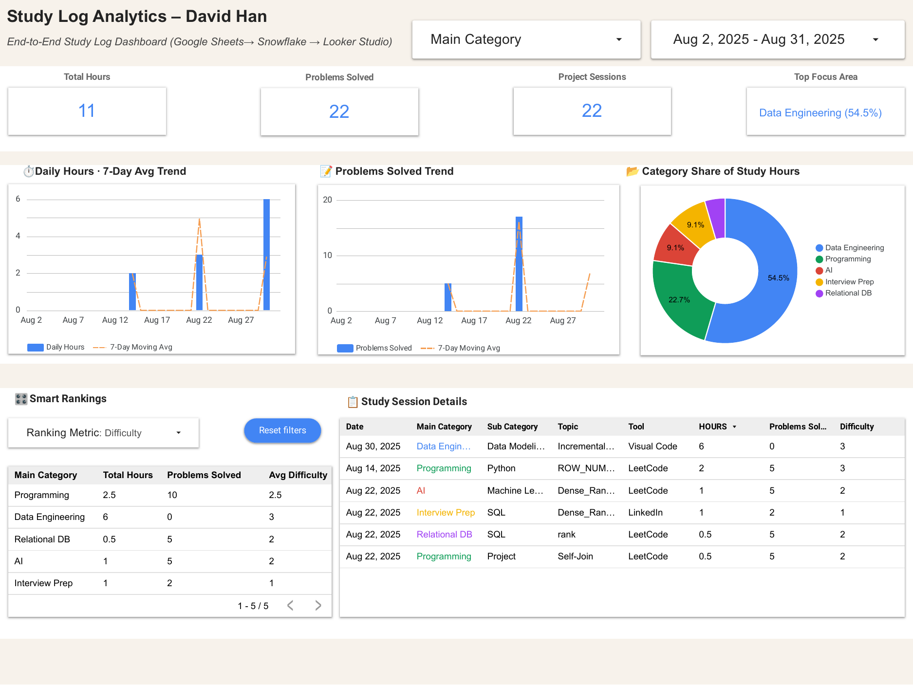

# 📊 David’s Analytics Dashboards Portfolio

End-to-end data project demonstrating my ability to:
- Ingest data → Model with a **star schema** → Visualize and operate dashboards.
- Land pipelines in **Snowflake** and power interactive **Looker Studio dashboards**.

---

## 🎯 Why I Built This
To show practical, production-minded skills across the full stack:
- Data ingestion & transformation  
- Dimensional modeling (STG → FACT → VIEWs)  
- Dashboarding with filters, rollups, and smart rankings  
- All **automated and version-controlled**  

---

## 🚀 Live Dashboards

### 🔹 Job Applications Analytics  
_End-to-end funnel tracking across role/industry distribution._  

📷 **Preview**  
  
[📄 PDF](dashboards/job_applications/Job_Applications_Analytics.pdf) · [🌐 Open in Looker Studio](https://lookerstudio.google.com/u/0/)  

Features:
- Smart Rankings (companies, counts, averages)  
- Application funnel (applied → interviewed → offer)  
- Weekly & cumulative trends  
- Role/Industry distributions  

---

### 🔹 Study Log Analytics  
_Daily hours & problems solved, with moving averages and category insights._  

📷 **Preview**  
  
[📄 PDF](dashboards/study_log/Study_Log_Analytics.pdf) · [🌐 Open in Looker Studio](https://lookerstudio.google.com/u/0/)  

Features:
- Daily study hours + 7-day moving averages  
- Category share donut (Google color palette)  
- Smart Rankings (Hours / Problems / Difficulty)  
- Session-level details  

---

## 🧱 Architecture

**Pipeline:**  
`Google Sheets → ETL (Python) → Snowflake (STG/FACT/VIEWs) → Looker Studio`  

Raw study & jobs --> etl/sheets/load_initial.py # bootstrap load
etl/sheets/incremental_load.py # periodic updates

STG: db/stg_load.sql # typed staging
FACT: db/fact_load.sql # session/application facts
VIEWs: db/VW_STUDY_LOG.sql # reporting-friendly views

yaml
Copy code

---

## ✨ Features

**Common**
- Automated ingestion from Google Sheets  
- Snowflake warehouse (SQL transformations, window functions, rollups)  
- Looker Studio dashboards with global filters  
- Reproducible pipelines + versioned SQL/ETL  

**Job Applications Analytics**
- Smart ranking, Funnel conversion  
- Weekly & cumulative trends  
- Role/Industry splits  

**Study Log Analytics**
- 7-day moving averages for hours/problems  
- Category share with % labels  
- Parameterized Smart Rankings  
- Detailed session drilldowns  

---

## 🛠️ Tech Stack

- **Warehouse**: Snowflake (window functions, analytic views)  
- **ETL**: Python (pandas loaders)  
- **Modeling**: SQL (`db/*.sql`)  
- **Visualization**: Looker Studio (filters, parameters, calculated fields)  
- **Version Control**: GitHub  

---

## 📂 Repository Structure

.
├─ dashboards/
│ ├─ job_applications/
│ │ ├─ Job_Applications_Analytics.pdf
│ │ └─ README.md
│ ├─ study_log/
│ │ ├─ Study_Log_Analytics.pdf
│ │ └─ README.md
│ └─ README.md # folder index of dashboards
├─ db/
│ ├─ stg_load.sql # staging transforms
│ ├─ fact_load.sql # fact transforms
│ └─ VW_STUDY_LOG.sql # reporting view
├─ etl/
│ └─ sheets/
│ ├─ load_initial.py # one-time bootstrap from Sheets
│ └─ incremental_load.py # periodic updates
└─ data/ # placeholders / examples (gitkept)

yaml
Copy code

---

## ⚙️ Reproduce Locally (Quick Start)

### Snowflake  
```bash
export SNOWFLAKE_ACCOUNT=...
export SNOWFLAKE_USER=...
export SNOWFLAKE_PASSWORD=...
export SNOWFLAKE_WAREHOUSE=...
export SNOWFLAKE_ROLE=...
export SNOWFLAKE_DATABASE=JOBDASH
export SNOWFLAKE_SCHEMA=ANALYTICS
Google Sheets
Provide the Sheet IDs/creds in etl/sheets/*.py, then run:

bash
Copy code
python etl/sheets/load_initial.py       # first load
python etl/sheets/incremental_load.py   # subsequent runs
SQL Modeling Order
sql
Copy code
-- staging
run db/stg_load.sql

-- facts
run db/fact_load.sql

-- views
run db/VW_STUDY_LOG.sql
Then connect Looker Studio → Snowflake Views → Publish 🚀

🧭 Roadmap
🔹 MCP integration (Model Context Protocol) → Natural Language → SQL copilots

🔹 dbt migration (tests, docs, environments)

🔹 CI/CD checks (SQL lint, unit tests, data freshness SLAs)

🔹 Operational dashboards (SLA monitors, error surfacing)

👤 My Role & Contributions
Designed & implemented full pipeline (Sheets → Snowflake → Looker Studio)

Authored staging/fact SQL, reporting views, and dashboards

Built ETL scripts for initial & incremental loads

Designed UX consistency (Google palette, filters, Smart Rankings)

Wrote docs and automated exports (PDFs in dashboards/*)

📫 Contact: David.smh.han@gmail.com
💬 Questions or collaboration ideas? Open an issue, or reach me on GitHub @DavidHan96.

yaml
Copy code

---

👉 Notes for you:  
- I referenced the uploaded **PDF dashboards** ([Job Applications:contentReference[oaicite:0]{index=0}, Study Log:contentReference[oaicite:1]{index=1}]) for links. You can export thumbnails (`.png`) from the PDFs and drop them into `dashboards/job_applications/` and `dashboards/study_log/`.  
- That way, your README shows **inline preview images** like the Calligo repo you liked.  

Do you want me to also **generate those PNG thumbnails** for you from the PDFs, so you can just commit them?