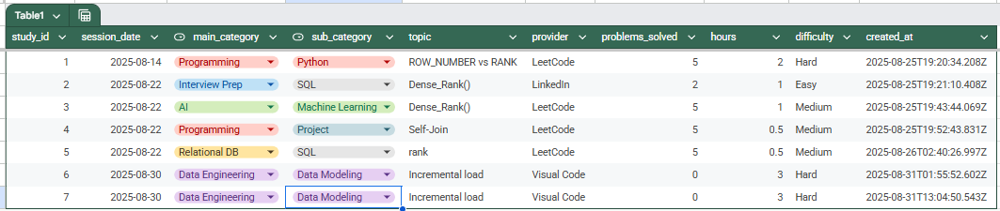

# 📊 David’s Analytics Dashboards Portfolio

<p align="left">
  <a href="https://www.python.org/">
    
  </a>
  <a href="https://www.snowflake.com/">
    
  </a>
  <a href="https://developers.google.com/sheets/api">
    
  </a>
  <a href="https://lookerstudio.google.com/">
    
  </a>
  <a href="https://pandas.pydata.org/">
    
  </a>
  <a href="https://git-scm.com/">
    
  </a>
  
  
</p>

End-to-end analytics project demonstrating:
- Ingestion from **Google Sheets** → Modeling in **Snowflake** (STAR schema) → Interactive **Looker Studio** dashboards  
- Production-minded ops: versioned SQL/ETL, dev→prod promotion, and scheduled refreshes

---

## 📑 Table of Contents
- [🎯 Why I Built This](#-why-i-built-this)
- [🚀 Live Dashboards](#-live-dashboards)
- [🧱 Architecture](#-architecture)
- [📥 Source Data & ETL](#-source-data--etl)
- [🧪 Looker Studio Deployment](#-looker-studio-deployment-dev--prod)
- [🏛️ Warehouse Schema](#-warehouse-schema-snowflake)
- [✨ Features](#-features)
- [🛠️ Tech Stack](#-tech-stack)
- [📂 Repository Structure](#-repository-structure)
- [⚙️ Reproduce Locally](#-reproduce-locally-quick-start)
- [🧭 Roadmap](#-roadmap)
- [👤 My Role & Contributions](#-my-role--contributions)

---

## 🎯 Why I Built This
To show hands-on, production-ready skills across the data lifecycle:
- Data ingestion & transformation with automated loaders  
- Dimensional modeling (RAW → STG → FACT → VIEWs)  
- Dashboard UX: filters, rollups, and smart rankings  
- Dev→Prod deploy with scheduled refresh & monitoring hooks  

---

## 🚀 Live Dashboards

### 🔹 Job Applications Analytics
[](https://lookerstudio.google.com/reporting/05a43d81-625f-4196-8616-76beb82abf3a "Open in Looker Studio")

Key views:
- Smart Rankings (companies, counts, averages)  
- Application Funnel (Applied → Interviewed → Offer)  
- Weekly & cumulative trends  
- Role / Industry distributions  

---

### 🔹 Study Log Analytics
[](https://lookerstudio.google.com/reporting/edeb330e-5a46-4eda-b1e1-1941c14eb872 "Open in Looker Studio")

Key views:
- Daily study hours + 7-day moving averages  
- Category share donut with labeled %  
- Smart Rankings (Hours / Problems / Difficulty)  
- Session-level details  

---

## 🧱 Architecture

**Pipeline:**  
`Google Sheets → ETL (Python) → Snowflake (RAW → STG → FACT/VIEWs) → Looker Studio`

```text
Raw study & jobs  -->  etl/sheets/load_initial.py   # first bootstrap from Sheets API
                    etl/sheets/incremental_load.py # idempotent upserts (created_at/last_modified)

STG:  db/stg_load.sql          # typing, cleaning, conforming
FACT: db/fact_load.sql         # application & study-session grains
VIEW: db/VW_STUDY_LOG.sql      # reporting-friendly columns & metrics

---

## 📥 Source Data & ETL

<p align="center">
  
  
</p>

- Google Sheets API (service account) + Python (`gspread`, `google-auth`, `pandas`)  
- Snowflake Python Connector for bulk load / upsert  
- `load_initial.py` seeds RAW tables; `incremental_load.py` loads only new/changed rows via `created_at` / `last_modified`  
- Idempotent behavior (dedupe on natural keys), strict types, date normalization  
- RAW→STG applies casting, trimming, and mappings; STG→FACT assembles star schema with conformed dimensions  

---

## 🧪 Looker Studio Deployment (Dev → Prod)

- Build & validate in **Dev** with live Snowflake connector  
- Convert to **Data Extract** sources and copy to Prod dashboard  
- Schedule auto-refresh daily at **06:30 (local)**  
- Result: Prod dashboards refresh automatically each morning; Dev remains live for iteration  

---

## 🏛️ Warehouse Schema (Snowflake)

<details>
<summary><b>Object inventory</b> (click to expand)</summary>

**Schemas**  
- RAW: `JOB_APPLICATIONS_RAW`, `STUDY_LOG_RAW`  
- STG: `JOB_APPLICATIONS_STG`, `STUDY_LOG_STG`  

**ANALYTICS (tables):**  
`DIM_COMPANY`, `DIM_DATE`, `DIM_LOCATION`, `DIM_PROVIDER`,  
`DIM_ROLE`, `DIM_SOURCE`, `DIM_TOPIC`, `DIM_WORK_ARRANGEMENT`,  
`FACT_JOB_APPLICATION`, `FACT_STUDY_SESSIONS`  

**ANALYTICS (views):**  
`VW_JOB_APPLICATIONS`, `VW_JOB_APPLICATIONS_AGG`, `VW_JOB_APPLICATIONS_FUNNEL`, `VW_STUDY_LOG`  

</details>

```mermaid
graph TD
  Sheets[Google Sheets] --> RAW[RAW tables]
  RAW --> STG[STG tables]
  STG --> FACT[FACT tables]
  FACT --> VIEW[Views (VW_*)]
  VIEW --> Looker[Looker Studio (Dev)]
  Looker --> Extracts[Data Extracts (Prod, 06:30 daily)]

---

## ✨ Features

**Common**
- Automated ingestion from Google Sheets  
- Snowflake warehouse (window functions, rollups)  
- Dev→Prod promotion via Looker Data Extracts  
- Scheduled refresh (06:30 daily)  
- Versioned SQL/ETL and reproducible setup  

**Job Applications Analytics**
- Smart ranking, Funnel conversion  
- Weekly & cumulative trends  
- Role/Industry splits  

**Study Log Analytics**
- 7-day moving averages (hours, problems)  
- Category share with % labels  
- Parameterized Smart Rankings  
- Detailed session drilldowns  

---

## 🛠️ Tech Stack

- **Warehouse**: Snowflake  
- **ETL**: Python (`pandas`, `gspread`, `google-auth`, `snowflake-connector-python`)  
- **Modeling**: SQL (db/*.sql, STAR schema)  
- **Visualization**: Looker Studio (Data Extract for Prod)  
- **Version Control**: GitHub  

---

## 📂 Repository Structure

```text
.
├─ dashboards/
│  ├─ job_applications/
│  │  ├─ Job_Applications_Analytics.png
│  │  ├─ application_google_sheet.png
│  │  └─ README.md
│  ├─ study_log/
│  │  ├─ Study_Log_Analytics.png
│  │  ├─ study_log_google_sheet.png
│  │  └─ README.md
│  └─ README.md
├─ assets/
│  └─ img/
│     └─ snowflake_schema.png
├─ db/
│  ├─ stg_load.sql
│  ├─ fact_load.sql
│  └─ VW_STUDY_LOG.sql
├─ etl/
│  └─ sheets/
│     ├─ load_initial.py
│     └─ incremental_load.py
├─ sheets/               # local dev helpers (optional)
├─ data/                 # placeholders / examples (gitkept)
└─ README.md

---

## ⚙️ Reproduce Locally (Quick Start)

**Snowflake Environment**
```bash
export SNOWFLAKE_ACCOUNT=...
export SNOWFLAKE_USER=...
export SNOWFLAKE_PASSWORD=...
export SNOWFLAKE_WAREHOUSE=...
export SNOWFLAKE_ROLE=...
export SNOWFLAKE_DATABASE=JOBDASH
export SNOWFLAKE_SCHEMA=ANALYTICS

Google Sheets Credentials
Provide the Sheet IDs and service-account JSON in etl/sheets/*.py (or via env vars).

Run loaders

python etl/sheets/load_initial.py       # bootstrap
python etl/sheets/incremental_load.py   # incremental updates

Modeling order

-- staging
run db/stg_load.sql;

-- facts
run db/fact_load.sql;

-- views
run db/VW_STUDY_LOG.sql;

Looker Studio

- Connect to Snowflake Dev and validate

- Convert to Data Extract sources

- Copy to Prod dashboard & set 06:30 daily refresh

---

## 🧭 Roadmap

- MCP integration (Model Context Protocol): natural language → parameterized SQL copilot  
- dbt migration (tests, docs, environments)  
- CI/CD (SQL lint, unit tests, freshness checks)  
- Ops dashboards (SLA, error surfacing)  

---

## 👤 My Role & Contributions

- Designed & implemented the pipeline (Sheets API → Snowflake → Looker Studio)  
- Authored staging/fact SQL, reporting views, and smart-ranking logic  
- Built initial + incremental loaders with idempotent upserts  
- Established Dev→Prod deployment using Looker Data Extracts (06:30 daily refresh)  
- Wrote documentation and organized repo structure  