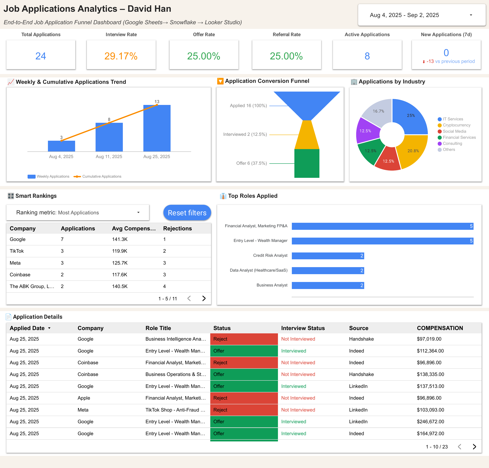
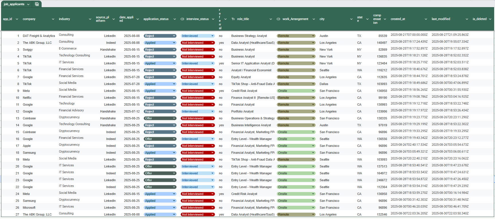

# 📊 David’s Analytics Dashboards Portfolio

<p align="left">
  <a href="https://www.python.org/">
    
  </a>
  <a href="https://www.snowflake.com/">
    
  </a>
  <a href="https://developers.google.com/sheets/api">
    
  </a>
  <a href="https://lookerstudio.google.com/">
    
  </a>
  <a href="https://pandas.pydata.org/">
    
  </a>
  <a href="https://git-scm.com/">
    
  </a>
  
  
</p>

End-to-end analytics project demonstrating:
- Ingestion from **Google Sheets** → Modeling in **Snowflake** (STAR schema) → Interactive **Looker Studio** dashboards  
- Production-minded ops: versioned SQL/ETL, dev→prod promotion, and scheduled refreshes

---

## 📑 Table of Contents
- [🎯 Why I Built This](#-why-i-built-this)
- [🚀 Live Dashboards](#-live-dashboards)
- [🧱 Architecture](#-architecture)
- [📥 Source Data & ETL](#-source-data--etl)
- [🧪 Looker Studio Deployment](#-looker-studio-deployment-dev--prod)
- [🏛️ Warehouse Schema](#-warehouse-schema-snowflake)
- [✨ Features](#-features)
- [🛠️ Tech Stack](#-tech-stack)
- [📂 Repository Structure](#-repository-structure)
- [⚙️ Reproduce Locally](#-reproduce-locally-quick-start)
- [🧭 Roadmap](#-roadmap)
- [👤 My Role & Contributions](#-my-role--contributions)

---

## 🎯 Why I Built This
To show hands-on, production-ready skills across the data lifecycle:
- Data ingestion & transformation with automated loaders  
- Dimensional modeling (RAW → STG → FACT → VIEWs)  
- Dashboard UX: filters, rollups, and smart rankings  
- Dev→Prod deploy with scheduled refresh & monitoring hooks  

---

## 🚀 Live Dashboards

### 🔹 Job Applications Analytics
[](https://lookerstudio.google.com/reporting/05a43d81-625f-4196-8616-76beb82abf3a "Open in Looker Studio")

Key views:
- Smart Rankings (companies, counts, averages)  
- Application Funnel (Applied → Interviewed → Offer)  
- Weekly & cumulative trends  
- Role / Industry distributions  

---

### 🔹 Study Log Analytics
[](https://lookerstudio.google.com/reporting/edeb330e-5a46-4eda-b1e1-1941c14eb872 "Open in Looker Studio")

Key views:
- Daily study hours + 7-day moving averages  
- Category share donut with labeled %  
- Smart Rankings (Hours / Problems / Difficulty)  
- Session-level details  

---

## 🧱 Architecture

**Pipeline:**  
`Google Sheets → ETL (Python) → Snowflake (RAW → STG → FACT/VIEWs) → Looker Studio`

```text
Raw study & jobs  -->  etl/sheets/load_initial.py   # first bootstrap from Sheets API
                    etl/sheets/incremental_load.py # idempotent upserts (created_at/last_modified)

STG:  db/stg_load.sql          # typing, cleaning, conforming
FACT: db/fact_load.sql         # application & study-session grains
VIEW: db/VW_STUDY_LOG.sql      # reporting-friendly columns & metrics

---

## 📥 Source Data & ETL

<p align="center">
  
  
</p>

- Google Sheets API (service account) + Python (`gspread`, `google-auth`, `pandas`)  
- Snowflake Python Connector for bulk load / upsert  
- `load_initial.py` seeds RAW tables; `incremental_load.py` loads only new/changed rows via `created_at` / `last_modified`  
- Idempotent behavior (dedupe on natural keys), strict types, date normalization  
- RAW→STG applies casting, trimming, and mappings; STG→FACT assembles star schema with conformed dimensions  
