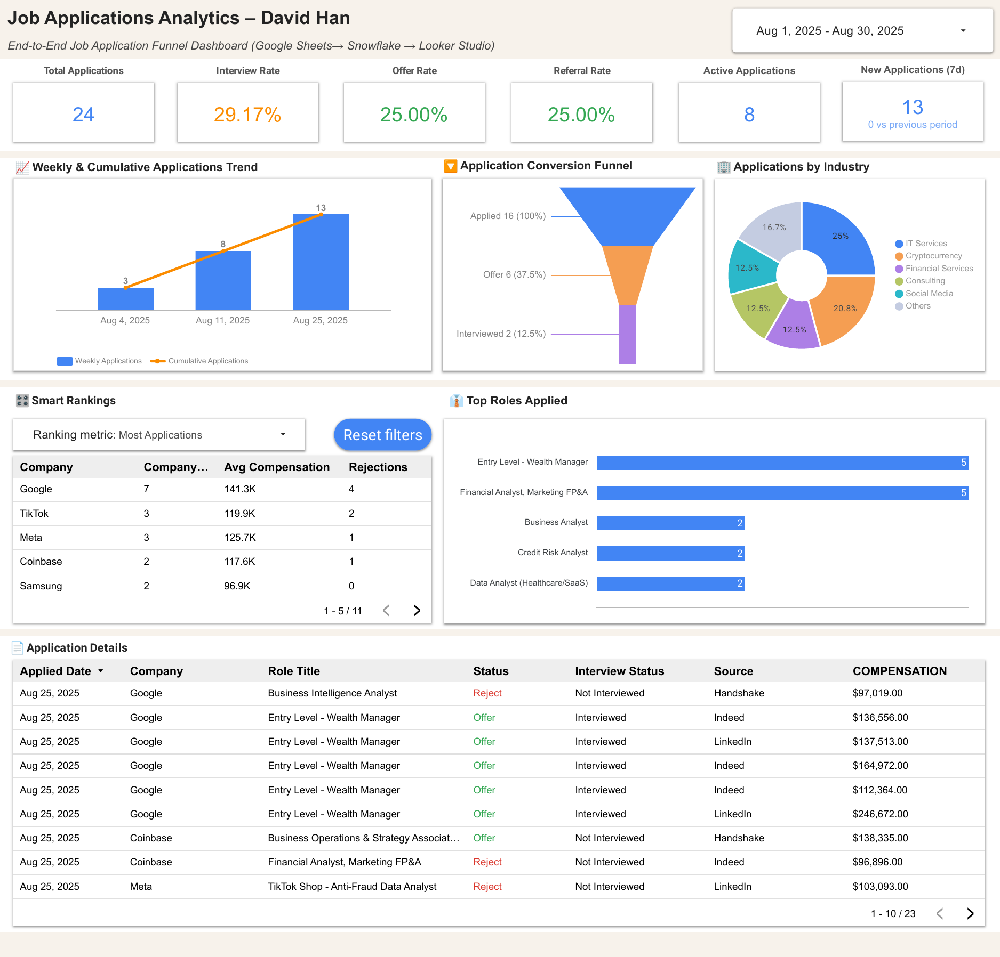
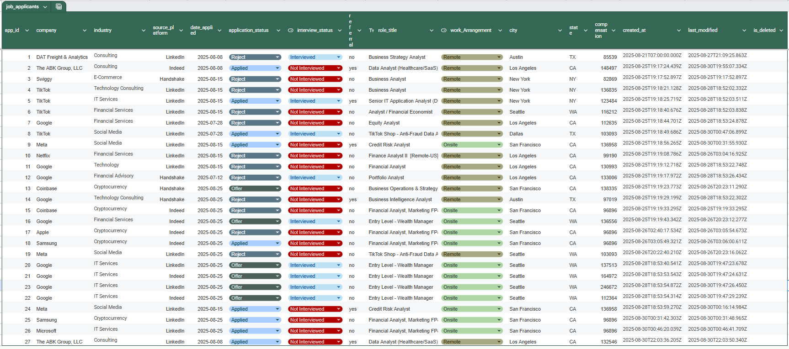

# Job Applications Analytics Dashboard

Google Looker Studio dashboard powered by Snowflake.  
[👉 Open in Looker Studio](https://lookerstudio.google.com/reporting/05a43d81-625f-4196-8616-76beb82abf3a)

## Source (Google Sheets)

---

## Features
- Smart Rankings of companies (applications, avg comp, rejections)
- Application Funnel (Applied → Interviewed → Offer)
- Weekly & cumulative trend analysis
- Role / Industry distribution
- Optional compensation breakdown

---

## Data Pipeline
- **Source:** Google Sheets  
- **Warehouse:** Snowflake (RAW → STG → FACT → VIEW)  
- **Visualization:** Looker Studio  

---

## Files in this folder
- `Job_Applications_Analytics.png` – dashboard thumbnail  
- `application_google_sheet.png` – source sheet preview  
- `Job_Applications_Analytics.pdf` – exported snapshot (optional)
