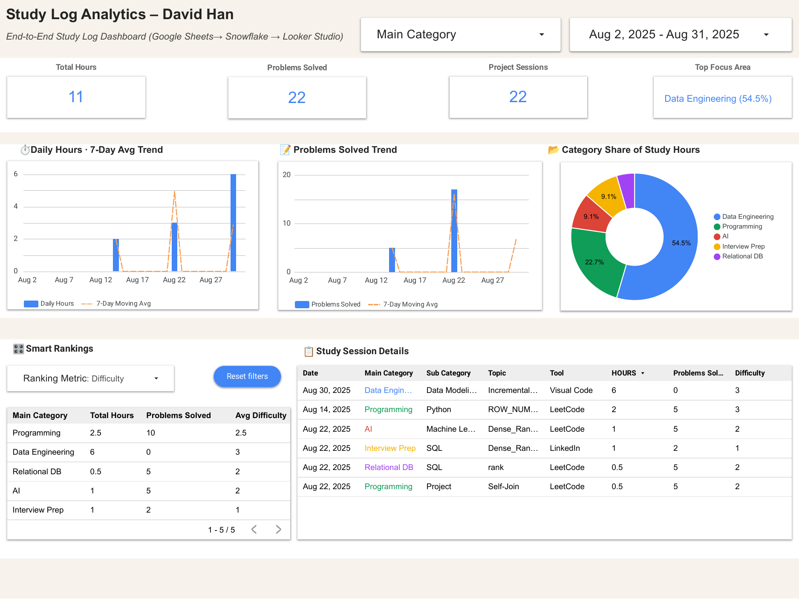

# Study Log Analytics Dashboard

Google Looker Studio dashboard powered by Snowflake.  
[👉 Open in Looker Studio](https://lookerstudio.google.com/reporting/edeb330e-5a46-4eda-b1e1-1941c14eb872)

## Source (Google Sheets)

---

## Features
- Daily study hours with 7-day moving average
- Problems-solved tracking with rolling average
- Category share (donut) + labels
- Smart Rankings (Hours / Problems / Difficulty)
- Session-level details with filters

---

## Data Pipeline
- **Source:** Google Sheets  
- **Warehouse:** Snowflake (RAW → STG → FACT → VIEW)  
- **Visualization:** Looker Studio  

---

## Files in this folder
- `Study_Log_Analytics.png` – dashboard thumbnail  
- `study_log_google_sheet.png` – source sheet preview  
- `Study_Log_Analytics.pdf` – exported snapshot (optional)
